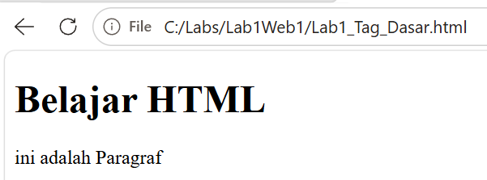

# Lab1Web1

# Membuat Struktur Dasar Dokumen HTML

# Membuat Paragraf

# Menambahkan Judul

# Memformat Teks

# Menyisipkan Gambar

# Menambahkan Hyperlink

# Menambahkan List

# Menggabungkan Semua Elemen

